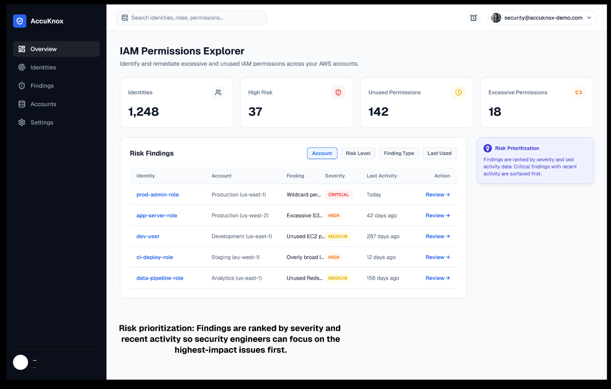
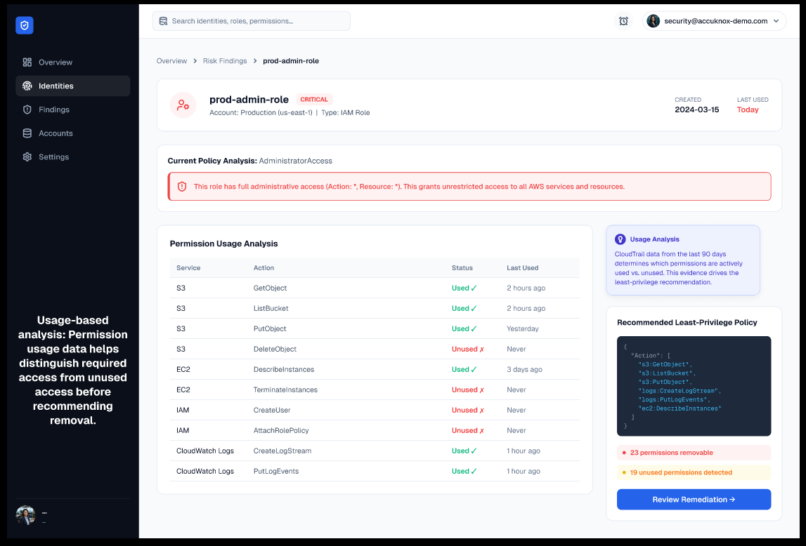
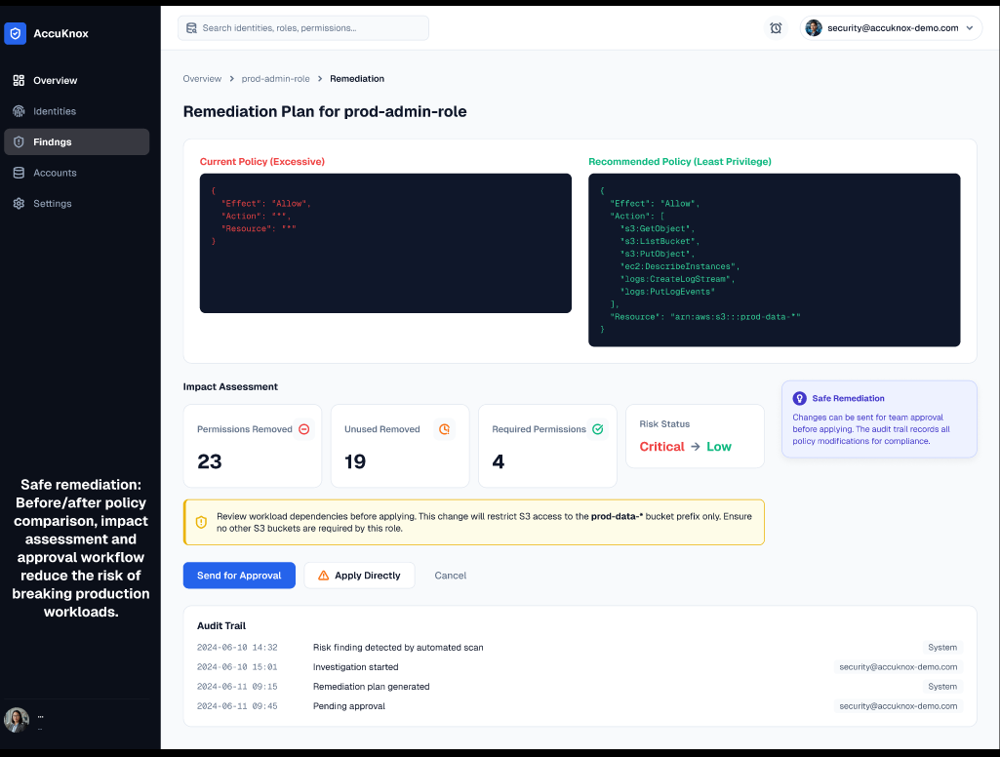

# AccuKnox — IAM Permissions Explorer

Product design and security UX assignment for AccuKnox.

**Candidate:** Sumangal Chhetri

## Figma Prototype

[View the AccuKnox IAM Permissions Explorer Prototype](https://www.figma.com/design/92BhmhVLvdUQimallaNEst/AccuKnox-%E2%80%93-IAM-Permissions-Explorer?node-id=0-1&t=BcwbFkzxOPhZRWfM-1)

## Assignment Document

[View the complete assignment PDF](./AccuKnox.pdf)

---

## Overview

IAM Permissions Explorer is a cloud security product concept designed to help Cloud Security Engineers identify, investigate, and safely remediate excessive and unused IAM permissions across cloud accounts.

### Core Workflow

**Discover → Investigate → Recommend → Remediate → Audit**

---

## User Persona

### Cloud Security Engineer

The primary user monitors IAM security across multiple cloud accounts and needs to prioritize risky findings, investigate permission usage, and safely remediate excessive access.

Key pain points include:

- Large numbers of IAM security findings.
- Difficulty identifying which permissions are actually required.
- Risk of breaking workloads when removing permissions.
- Lack of actionable context around security findings.

---

## Prototype Screens

### 1. IAM Security Overview

The dashboard helps security engineers identify and prioritize high-risk IAM findings using severity, account, finding type, and last-used activity.

### 2. Permission Investigation

The investigation view compares granted permissions with observed usage, helping engineers understand which permissions are required and which may be excessive or unused.

### 3. Remediation Plan

The remediation view provides a before/after policy comparison, impact assessment, least-privilege recommendation, approval workflow, and audit trail.

---

## Key Design Decisions

- **Risk-based prioritization:** Focus attention on high-impact IAM findings first.
- **Usage-based investigation:** Provide evidence before recommending permission removal.
- **Least-privilege recommendations:** Convert security findings into actionable remediation.
- **Safe remediation:** Use policy comparison and approval before production changes.
- **Auditability:** Maintain traceability for security-sensitive changes.

---

## Feature Prioritization

### Must Have

1. **Risk-based IAM Dashboard**
2. **Permission Usage Investigation**
3. **Least-Privilege Recommendations**

These form the minimum workflow required to identify a problem, understand it, and determine an appropriate remediation.

### Next

4. **Safe Remediation & Approval**
5. **Audit Trail**

These capabilities make the workflow safer and more suitable for enterprise environments.

---

## Success Metrics

- Reduction in excessive and unused permissions.
- Median time from finding discovery to remediation decision.
- Percentage of recommended remediations accepted.
- Percentage of high-risk findings resolved.
- Percentage of remediation changes completed without workload-related incidents.

---

## Bonus — Development Action Items

- Integrate AWS IAM and CloudTrail initially, with future multi-cloud support.
- Build permission analysis and risk-scoring services.
- Generate and validate least-privilege policy recommendations.
- Add policy simulation, approval, rollback, and audit capabilities.
- Test recommendations against representative production-like workloads.

---

## Technologies / Concepts Considered

- AWS IAM
- AWS CloudTrail
- Cloud Security
- Identity and Access Management
- Least Privilege
- Kubernetes / Cloud Workloads
- Risk-Based Security
- Policy Analysis
- Security Auditability
